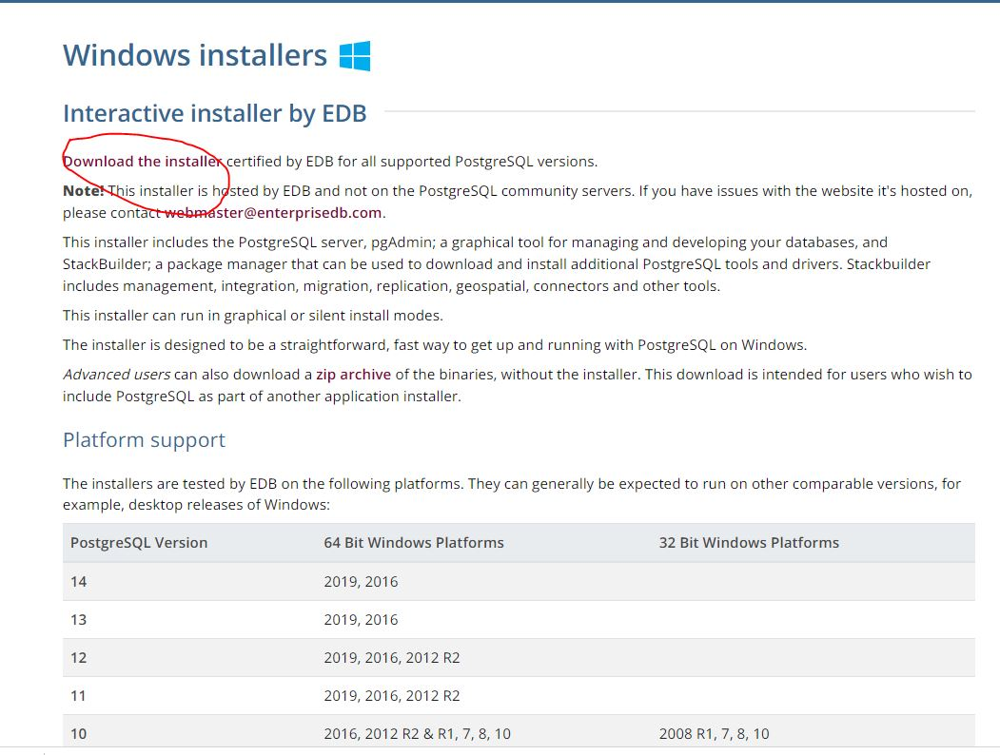
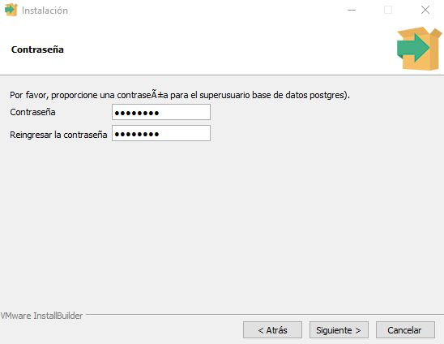

# Conectarse a una instancia RDS desde windows:
Para conectarte a tu instancia RDS desde windows, podrás seguir la liga de la [documentación oficial](https://docs.aws.amazon.com/AmazonRDS/latest/UserGuide/USER_ConnectToPostgreSQLInstance.html)

Volvemos a la sección de Todos los servicios y ahora seleccionamos la opción de RDS:


En la parte izquierda encontrarás la opción de Bases de datos:


Ahí, le damos clic al nombre de la base de datos


Ahí encontrarás el punto de enlace y el puerto


# Step 2: Install PostgreSQL
En windows, es necesario que instales PostgreSQL en la siguiente [página oficial](https://www.postgresql.org/). Dando click en el botón de Download:


Ahí seleccionaremos la opción de tu sistema operativo. En mi caso, usaremos windows:


Damos clic en Download the installer:


dado que mi computadora es de 64 bits, descargaré el instalador para windows de 64 bits.


Se descargará un archivo ejecutable, el cual hay que abrir.

La guía de instalación se puede encontrar [aqui](https://www.enterprisedb.com/docs/supported-open-source/postgresql/installer/02_installing_postgresql_with_the_graphical_installation_wizard/01_invoking_the_graphical_installer/)

Al abrir, aparecerá la siguiente ventana: 


Dar clic en siguiente.

En cuanto a la ruta de instalación, mantendré la que viene por default


Dar clic en siguiente. 
Dejar todas las opciones seleccionadas por default.


En cuanto al directorio de datos, mantendré las opciones por default.

Dar clic en siguiente.

Pedirá una contraseña.
Por simplicidad pondré 12345678


Clic en siguiente

El puerto pondremos 5432 (el valor por default)


En opciones avanzadas mantendremos la configuración por defecto.


En el resumen de lo que se instalará, dar siguiente.


Aparecerá esta ventana, donde tendremos que elegir la instalación de PostgreSQL que hicimos.


seleccionar los siguientes paquetes:


Clic en siguiente.

No seleccionar la casilla de skip Installation y presionar cancel


# Step 3: Agregar psql al path del sistema
Nos vamos a inicio y tecleamos variables para que nos aparezca lo siguiente:


Entramos a la opción que dice "Editar las variables de entorno de esta cuenta

En la parte de Variables de usuario seleccionamos la variable Path y le damos editar...


Ponemos la opción de Nuevo y escribimos lo siguiente
```bash
C:\Program Files\PostgreSQL\14\bin
```
Clic en aceptar

Hora, si abres una nueva terminal y presionas psql, te darás cuenta de que ya está instalado postgres en tu computadora.

# Step 4: Conectarse a la base de datos
Ingresa desde la terminal el siguiente comando:
```bash
psql --host=your_host_name --port=5432 --username=postgres --password=your_password --dbname=your_database_name
```
En mi caso, el código fue el siguiente:

```bash
psql --host=databasecrehana.cpoinii39vab.us-east-1.rds.amazonaws.com --port=5432 --username=postgres --password=12345678 --dbname=dbcrehana
```

# Step 5: Add data to database
correr el siguiente comando:
```SQL
CREATE TABLE Ordenes (id_cliente int, cantidad_de_chapatas int, Estatus VARCHAR(30), precio_chapatas int, LastUpdated timestamp);

INSERT INTO Ordenes VALUES(1,2,'Backordered',190,'2021-10-09 12:00:00');
INSERT INTO Ordenes VALUES(2,2,'Shipped',190,'2021-10-09 13:00:00');
INSERT INTO Ordenes VALUES(1,1,'Delivered',95,'2021-10-09 12:30:00');
INSERT INTO Ordenes VALUES(3,2,'Backordered',190,'2021-10-09 15:00:00');
INSERT INTO Ordenes VALUES(4,2,'Shipped',190,'2021-10-09 10:00:00');
INSERT INTO Ordenes VALUES(5,2,'Delivered',190,'2021-10-09 16:20:00');
INSERT INTO Ordenes VALUES(6,3,'Backordered',285,'2021-10-09 09:00:00');
INSERT INTO Ordenes VALUES(7,2,'Shipped',190,'2021-10-09 18:50:00');
INSERT INTO Ordenes VALUES(8,4,'Backordered',380,'2021-10-09 14:30:00');
INSERT INTO Ordenes VALUES(4,2,'Shipped',190,'2021-10-09 12:00:00');
```

Verificar creación de datos con el siguiente comando:
```SQL
SELECT * FROM Ordenes;
```

CREATE TABLE Ordenes (id_cliente int, cantidad_de_chapatas int, Estatus VARCHAR(30), precio_chapatas int, LastUpdated timestamp);


CREATE TABLE inai.raw (id_registro VARCHAR(30), FOLIO VARCHAR(30), FECHASOLICITUD TIMESTAMP, DEPENDENCIA TEXT, ESTATUS VARCHAR(30), MEDIOENTRADA VARCHAR(30), TIPOSOLICITUD VARCHAR(30), DESCRIPCIONSOLICITUD TEXT, OTROSDATOS TEXT, ARCHIVOADJUNTOSOLICITUD TEXT, MEDIOENTREGA VARCHAR(30), FECHALIMITE DATE,RESPUESTA TEXT, TEXTORESPUESTA TEXT, ARCHIVORESPUESTA TEXT, FECHARESPUESTA DATE,PAIS  VARCHAR(30), ESTADO VARCHAR(30), MUNICIPIO VARCHAR(30), CODIGOPOSTAL VARCHAR(30), SECTOR VARCHAR(30));